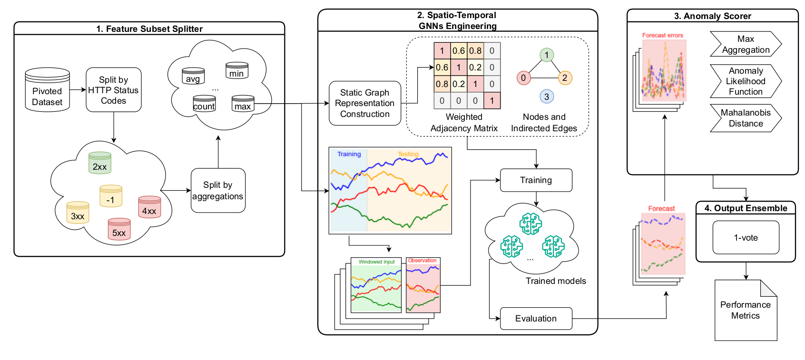

# ClouDens: A Scalable Ensemble Framework for Anomaly Detection in Large-Scale Cloud Systems

[](https://doi.org/10.5281/zenodo.14062900)


This repository contains the code implementation for the paper submitted in ICSE 2026 Research Track with title **"ClouDens: A Scalable Ensemble Framework for Anomaly Detection in Large-Scale Cloud Systems"**.

The repository includes scripts and modules for anomaly detection using Spatio-Temporal Graph Neural Networks (ST-GNNs), NAB scoring, and related preprocessing tasks. 
The pipeline is modularized for flexibility and ease of use.

## 🔍 Overview




ClouDens builds upon the ST-GNNs architecture and introduces ensemble enhancements tailored for detecting anomalies in complex cloud environments. This repository includes:

- Script for preprocessing the IBM Cloud Dataset
- Forecasting-based Architecture Code Implementation for  ClouDens and a GRU-based model
- Anomaly scoring based on forecast errors with different strategies, including *Max Aggregation*, *Anomaly Likelihood Function*, and *Mahalanobis Distance*
- Evaluation scripts for the final ensemble approach, calculating NAB scores and other metrics

---

# Project Setup: Anomaly Data Preparation

This guide helps you set up the environment for the ClouDens project. Follow these steps to ensure you have the correct Python version and dependencies installed for replicability.

---

## 1 Requirements

- **Python Version**: Python 3.12.2
- **Operating System**: Windows, macOS, or Linux
- **Tools**:
  - Python installed on your system
  - `pip` for package management
  - A terminal or command-line interface

---

## 2 Setup Instructions


### 2.1 Clone the Repository
Clone the repository to your local machine:
```bash
git clone https://github.com/ClouDens/icse2026_cloudens_ad.git
```

Navigate to the project directory:
```bash
cd icse2026_cloudens_ad
```

### 2.2 Verify Python Version
Ensure you have Python 3.12.2 installed:
```bash
python --version
```
If Python 3.12.2 is not installed, download it from the [official Python website](https://www.python.org/downloads/release/python-3122/) and install it.


### Setup Options
> **Using a Virtual Environment**:  
> Continue with the steps below and refer to [Section 5.2 Using Virtual Environment](#52-using-virtual-environment) for execution instructions.


### 2.3 Create a Virtual Environment
Create a virtual environment using Python 3.12.2:
```bash
python -m venv venv
```

### 2.4 Activate the Virtual Environment
Activate the virtual environment:

- **On Windows**:
  ```bash
  venv\Scripts\activate
  ```
- **On macOS/Linux**:
  ```bash
  source venv/bin/activate
  ```

Verify that the virtual environment is using Python 3.12.2:
```bash
python --version
```

### 2.5 Install Dependencies
Install all required libraries from the `requirements.txt` file:
```bash
pip install -r requirements.txt
```

### 2.6 Run Tests
Run a test script or a few commands from the project to ensure everything is working correctly.

### 2.7 Optional: Update Dependencies
If additional libraries are needed, install them and update `requirements.txt`:
```bash
pip install <library-name>
pip freeze > requirements.txt
```

### 2.8 Directory Structure

Use the following directory structure for your project:

```plaintext
icse2026_cloudens_ad/
├── conf/                # Configuration files (e.g., config.yaml)
├── src/                 # Source code files
├── data/
│   ├── massaged/        # Pivoted input data
│   ├── labels/          # Anomaly window labels
├── experiment_results/  # Experiment results presented in the paper
│   ├── ...              
│   ├── table_4_full.png
├── trained_models/      # Saved trained models and related outputs
```

You can **create these directories** using the following shell script:

```bash
mkdir -p conf src data/massaged data/labels experiment_results trained_models
```


## 3 Data Source
The data required for this project is provided in the following dataset:
> Islam, M. S., Rakha, M. S., Pourmajidi, W., Sivaloganathan, J., Steinbacher, J., & Miranskyy, A. (2024).
> Dataset for the paper "Anomaly Detection in Large-Scale Cloud Systems: An Industry Case and Dataset" (v1.0) [Data set].
> Zenodo. https://doi.org/10.5281/zenodo.14062900

### 3.1 Input Data

- Place pivoted data files (e.g., `pivoted_data_all.parquet`) in `data/massaged/`.
- Place anomaly window labels `anomaly_windows.csv` in `data/labels/`.

You can achieve this using the following commands in the terminal (on macOS/Linux):
```shell
curl -L -o data/labels/anomaly_windows.csv https://zenodo.org/records/14062900/files/anomaly_windows.csv?download=1
curl -L -o data/massaged/pivoted_data_all.parquet https://zenodo.org/records/14062900/files/pivoted_data_all.parquet?download=1
```


---
> **For manual setup using a virtual environment**, after downloading the files, proceed to [Section 5.2 Using Virtual Environment](#52-using-virtual-environment) for execution details.


## 4 File Descriptions

### 4.1 Configuration

- **`config.yaml`**: Stores the configuration for preprocessing tasks, model settings, and evaluation.

### 4.2 Scripts

[//]: # (- **`run_experiment__multi_models_GRU_ANN.py`**: The main script for coordinating anomaly detection experiments. It handles data preprocessing, model training, evaluation, and grid search for optimizing parameters.)

- **`preprocessing.py`**: Built-ins to handle data preparation, including loading feature subsets, and filtering training/testing anomaly windows.

- **`anomaly_likelihood.py`**: Contains functions to compute anomaly likelihood using reconstruction errors and statistical analysis.

- **`nab_scoring.py`**: Implements NAB (Numenta Anomaly Benchmark) scoring, including options for standard scoring or custom profiles like `reward_fn`.

- **`plotting_module.py`**: Provides utilities for visualizing the results of anomaly detection, such as normalized 5XX counts and detected anomalies.
- **`ibm_dataset_loader.py`**: A class to manage all relevant information of a feature subset input
- **`utils.py`**: Built-ins to handle basic operations
- **`run_preprocessing.py`**: Script to run pre-processing tasks, supporting handling a single or multiple feature subsets
- **`run_training_single_model.py`**: Script to train forecasting model on a single feature subset
- **`run_ensemble_approach.py`**: Script to ensemble outputs of multiple based models on different feature subets

### 4.3 Results Directory (`./trained_models`)
#### Folder structure
```plaintext
trained_models/
├── ensemble/                                    # Output of the ensemble approach
├── no_group_4xx_avg        
│   ├── A3TGCN/                                  # A3TGCN trained model and relevant outputs on `4xx avg` feature subset   
│   │   ├── A3TGCN_autoencoder.pt                # Saved model
│   │   ├── A3TGCN_grid_search.csv               # NAB Score with different thresholds and post-processing strategies
│   │   ├── A3TGCN_predictions_for_assembles.csv # Predicted labels for ensembling
│   │   ├── A3TGCN_train_val_losses.png
│   │   ├── mahalanobis.npy                      # Mahalanobis distance corresponding to `reconstruction_errors.npy`, saved for reuse
│   │   ├── mse_error.txt                        # MSE error on test data
│   │   ├── reconstruction_errors.npy            # Raw forecast errors for post-processing
│   ├── GRU/                                     # GRU trained model and relevant outputs on `4xx avg` feature subset
├── no_group_4xx_count/
├── no_group_4xx_min/ 
├── no_group_4xx_max/ 
├── no_group_5xx_avg/ 
├── no_group_5xx_count/ 
├── no_group_5xx_min/ 
├── no_group_5xx_max/ 
```

#### Files:

- **`no_group_4xx_avg/A3TGCN`**: A folder contains detailed results from the anomaly detection experiments using the `A3TGCN` model, including the saved 
    trained model, raw forecast errors, Mahalanobis Distance, Grid Search Output with different metrics such as 
    true positives, false positives, and anomaly windows, for the entire test period.
- **`no_group_4xx_avg/GRU`**: A folder contains the trained model on `4xx_avg` feature subset, with different outputs for evaluation like `A3TGCN` model

- **`A3TGCN_grid_search.csv`**: Consolidated results of the experiments with the specified model, providing a summary of key performance metrics.
- **`ensemble`**: Contains ensemble results
---

## 5 Execution - Using Virtual Environment

The workflow is configured using the [Hydra](https://github.com/facebookresearch/hydra) framework.

#### Split the pivoted dataset into different feature subsets
The selected HTTP Status Codes and Aggregations can be configurable in the `config.yaml` file. 
Modify the following parameters under `data_preparation_pipeline`:
```yaml
data_preparation_pipeline:
  multiple_preprocessing: false # true or false
  feature_subsets:
    http_codes: ['5xx','4xx'] # http codes can be 1xx, 2xx, 3xx, 4xx, 5xx
    aggregations: ['count','avg','min','max']
    
  features_prep:
    filter:
      http_codes: ['5xx'] # http codes can be 1xx, 2xx, 3xx, 4xx, 5xx
      aggregations: ['count']
```
If `multiple_preprocessing: false`, the preprocessing script extracts and processes a single feature subset based on the 
specified HTTP status codes and aggregation method defined under `features_prep.filter` 
(`http_codes` and `aggregations`).

If set to `multiple_preprocessing: true`, the script generates multiple feature subsets by iterating over 
all combinations of `http_codes` and `aggregations` specified in `data_preparation_pipeline.feature_subsets`.

To extract feature subsets, preprocess them, and save the results to disk, run:
```bash
python src/run_preprocessing.py
```
This script will apply the preprocessing pipeline based on your configuration settings in `config.yaml`.

After preprocessing multiple feature subsets, the project directory will be organized as follows:
```plaintext
icse2026_cloudens_ad/
├── conf/                # Configuration files (e.g., config.yaml)
├── src/                 # Source code files
├── data/
│   ├── massaged/        # Pivoted input data
│   │   ├── extracted
│   │   │   ├── no_group_4xx_avg                # Feature subset folder according to 4xx (Status Code) and avg (Aggregation)
│   │   │   │   ├── adjacency_matrix.npy        # Adjacency matrix
│   │   │   │   ├── filtered_raw_data.parquet   # Processed data corresponding to feature subset
│   │   │   │   ├── meta_data.json              # Additional information about the graph representaion
│   │   │   ├── no_group_4xx_count
│   │   │   ├── ...  
│   ├── labels/          # Anomaly window labels
├── trained_models/      # Saved trained models
```
#### 5.2.1 Configuring the Base Model Architecture

The model type (e.g., A3T-GCN or GRU) is configurable in the `config.yaml` file. Modify the following parameters under `evaluation`:

```yaml
evaluation:
  retrain: false
  use_model: 'GRU' # 'A3TGCN' or 'GRU'
```


#### 5.2.3 Run the Project
To train a single model on a single feature subset, execute the following script after setting up the required directories and input files:

```bash
python src/run_training_single_model.py
```
This script will choose the model and the feature subset based on your configuration settings in `config.yaml`, 
under `evaluation.use_model` and `data_preparation_pipeline.features_prep.filter`.

Note that you can pass configuration parameters directly via the command line. For example:
```bash
python src/run_training_single_model.py evaluation.use_model=A3TGCN evaluation.retrain=true  
```

To get output of ensemble approach after training on all feature subsets (8 subsets in our paper), execute the following script:

```bash
python src/run_ensemble_approach.py
```
This script will choose feature subsets based on your configuration settings in `config.yaml`, 
by iterating over 
all combinations of `http_codes` and `aggregations` specified in `evaluation.ensembles`, 

Note that you can pass configuration parameters directly via the command line. For example:
```bash
python src/run_training_single_model.py evaluation.use_model=A3TGCN evaluation.retrain=true  
```

---

## Notes for Replicability

- Use Python 3.12.2 to avoid compatibility issues.
- Keep the `requirements.txt` file up-to-date if new dependencies are added.
- Use the exact steps mentioned above to ensure a consistent environment across different setups.

---

